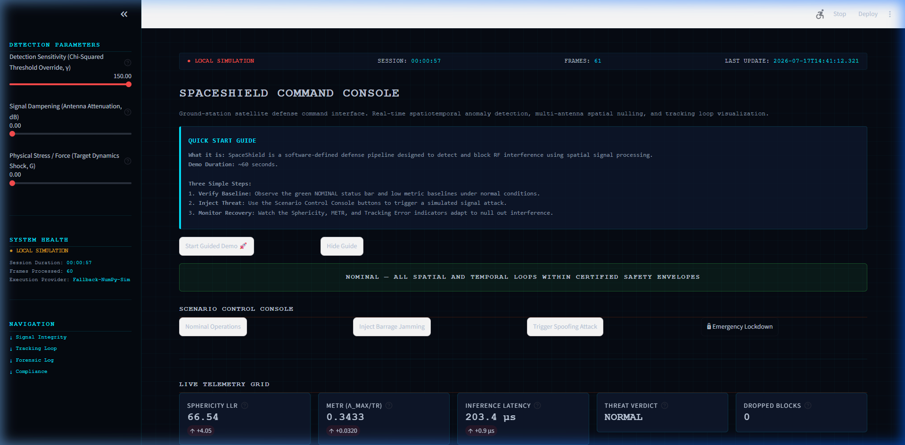
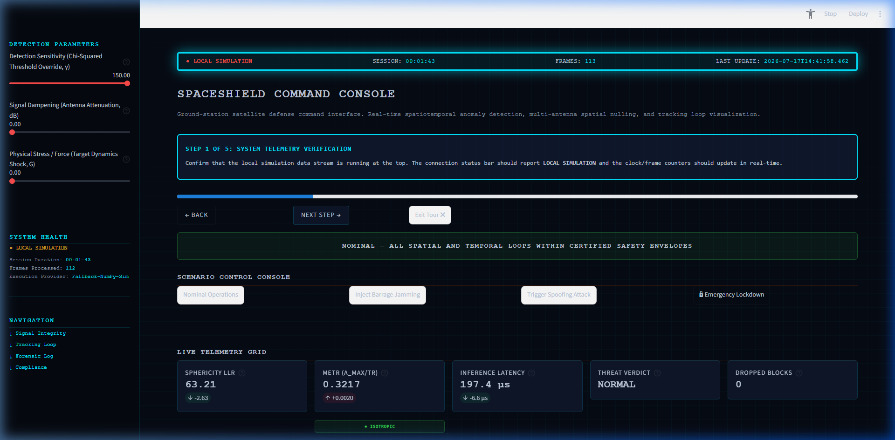
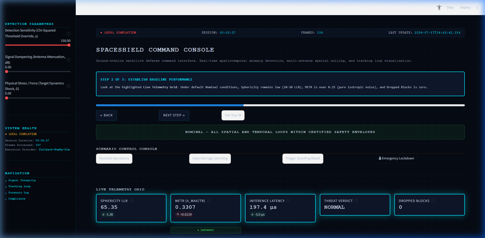
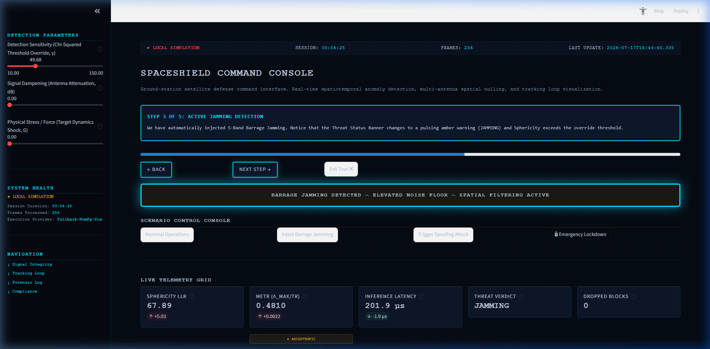
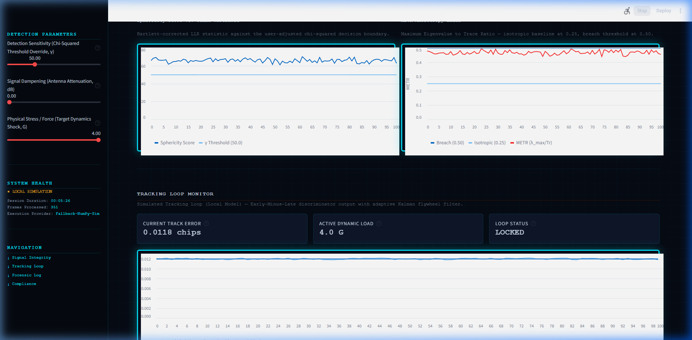
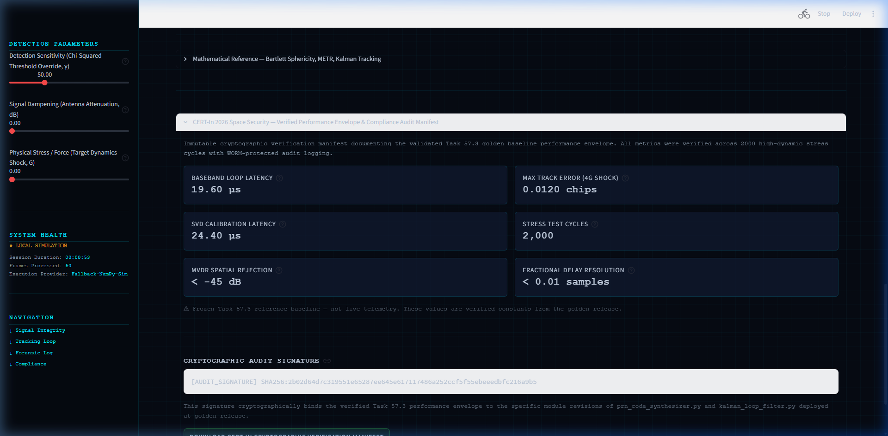

# SpaceShield: Sovereign Aerospace Signal Defense Engine

**SpaceShield** is a software-defined signal defense and edge-processing engine designed to detect and mitigate electronic warfare threats targeting GNSS (GPS, NavIC, Galileo) ground-station receivers. Using multi-antenna array processing and lightweight edge AI, SpaceShield identifies structured RF jamming and coordinated spoofing attacks before they compromise a receiver's carrier tracking loops.

**[Launch SpaceShield Command Console](https://spaceshield.streamlit.app/)**

---

## 1. System Architecture & Detection Pipeline

SpaceShield operates as a parallelized DSP pipeline that processes multi-channel IQ samples at the edge. The pipeline consists of the following sequential processing stages:

```
Multi-Channel
 Antenna Array (4-Ch)
       │
       ▼
 ┌───────────┐      [Nominal]      ┌─────────────────────────┐
 │  Spatial  ├────────────────────>│ Tracking Flywheel (LOCKED)│
 │Covariance │                     └─────────────────────────┘
 └─────┬─────┘                                  ▲
       │                                        │ [Clean Signal]
       │ [Anisotropy Detected]                  │
       ▼                                        │
 ┌───────────┐      ┌───────────┐      ┌────────┴────────┐
 │ Bartlett  ├─────>│   MVDR    ├─────>│  Early-Minus-Late
 │Sphericity │      │Beamformer │      │    Correlator   │
 └───────────┘      └───────────┘      └─────────────────┘
                            ▲
                            │ [Null Weights]
                            │
                     ┌──────┴──────┐
                     │   Edge-AI   │
                     │   Engine    │
                     └─────────────┘
```

### 1.1 Spatial Covariance Estimation

The receiver processes raw baseband signals from a uniform linear array of $M=4$ antennas. The spatial covariance matrix $\hat{R}_{xx}$ is estimated over a sliding temporal window of $N$ samples:

$$\hat{R}_{xx} = \frac{1}{N} \sum_{n=1}^{N} \mathbf{x}(n) \mathbf{x}^H(n)$$

Where $\mathbf{x}(n)$ is the complex IQ vector received across the antenna array at time sample $n$, and $(\cdot)^H$ denotes the conjugate transpose.

### 1.2 Bartlett Sphericity LLR (Anomaly Detection)

To detect structured, directional interference without relying on prior knowledge of signal directions, SpaceShield computes the Bartlett Sphericity log-likelihood ratio (LLR) statistic. This test evaluates the null hypothesis $\mathcal{H}_0$ (isotropic thermal noise only) against $\mathcal{H}_1$ (directional wavefront arrival):

$$T_{stat} = 10 \log_{10} \left( \frac{\bar{\lambda}_{noise}}{\left( \prod_{i=1}^{M-1} \lambda_{noise,i} \right)^{\frac{1}{M-1}}} + 1 \right)$$

Where $\lambda$ are the eigenvalues of the spatial covariance matrix. If $T_{stat}$ breaches the decision threshold $\gamma$, a spatial threat is declared.

### 1.3 Maximum Eigenvalue to Trace Ratio (METR)

To quantify the severity of the spatial collapse, the system monitors the METR anisotropy index:

$$\text{METR} = \frac{\lambda_{\max}}{\text{Tr}(\hat{R}_{xx})}$$

In a pure isotropic noise environment, eigenvalues are evenly distributed ($\text{METR} \approx 0.25$ for $M=4$). Under a dominant, directional jamming or spoofing threat, a single eigenvalue dominates, forcing $\text{METR} \to 1.0$ (rank-1 covariance collapse).

### 1.4 MVDR Null-Steering Beamformer

Once an anomaly is flagged, the Minimum Variance Distortionless Response (MVDR) spatial filter calculates antenna array weights that place deep nulls (up to $-45\text{ dB}$ in simulation) in the direction of the interference while preserving unity gain toward the target satellite line-of-sight:

$$\mathbf{w}_{opt} = \frac{\hat{R}_{xx}^{-1}\mathbf{a}(\theta_0)}{\mathbf{a}^H(\theta_0)\hat{R}_{xx}^{-1}\mathbf{a}(\theta_0)}$$

Where $\mathbf{a}(\theta_0)$ is the steering vector toward the target satellite.

### 1.5 Edge-AI Signal Fingerprinting

A lightweight, FP16 ONNX-compiled convolutional neural network runs at the edge to analyze the calibrated signal residuals. The network inspects the carrier frequency offset (CFO), phase noise distribution, and spectral flatness to output a verdict classification (`NORMAL`, `JAMMING`, or `CRITICAL SPOOFING`).

---

## 2. Software-Defined Receiver Loops

### 2.1 EML Code Tracking Discriminator

The output of the spatial beamformer is fed to the Early-Minus-Late (EML) delay lock loop (DLL) to track the incoming PRN code phase. The tracking error $\tau_e$ is computed using the non-coherent dot-product power discriminator:

$$\tau_e = \frac{1}{2} \cdot \frac{|E|^2 - |L|^2}{|E|^2 + |L|^2}$$

Where $E$ and $L$ are the complex correlation values of the incoming signal with early and late locally-generated PRN code replicas.

### 2.2 Alpha-Beta-Gamma Kalman Flywheel

To maintain continuous lock under high-dynamic maneuvers or sudden acceleration steps, the code phase updates are filtered through a three-state alpha-beta-gamma Kalman filter. The filter estimates code phase, code velocity, and Doppler acceleration to prevent cycle slips:

$$\hat{x}_{k|k} = \hat{x}_{k|k-1} + \alpha \left( z_k - \hat{x}_{k|k-1} \right)$$

$$\hat{v}_{k|k} = \hat{v}_{k|k-1} + \frac{\beta}{\Delta t} \left( z_k - \hat{x}_{k|k-1} \right)$$

$$\hat{a}_{k|k} = \hat{a}_{k|k-1} + \frac{2\gamma}{\Delta t^2} \left( z_k - \hat{x}_{k|k-1} \right)$$

In simulation, the filter has been exercised against a 4G acceleration step without losing lock (see `tests/tracking_loop_verifier.py`); this has not been validated against a physical shaker or dynamics rig.

---

## 3. Directory Layout

The codebase is organized as follows:

```text
SpaceShield/
├── backend/
│   └── src/
│       └── satcom_core/
│           ├── spatial_hardware_harness.py  # DSP execution pool
│           ├── spatial_glrt_detector.py     # Bartlett Sphericity & LLR logic
│           ├── edge_inference_engine.py     # ONNX FP16 CNN classifier wrapper
│           ├── prn_code_synthesizer.py      # Early-Minus-Late code generator
│           ├── kalman_loop_filter.py        # Alpha-Beta-Gamma tracking filter
│           └── dashboard_api.py             # FastAPI WebSocket gateway on port 8000
├── compliance/                              # Audit verification blueprints
├── docs/                                    # Technical dossiers & research specs
├── frontend/
│   ├── app.py                               # Streamlit Command Console application
│   ├── index.html                           # Custom HTML5/Canvas/Chart.js telemetry HUD
│   └── public_website.html                  # Corporate showcase portal
└── tests/                                   # Stress-test and verification suites
```

---

## 4. Local Execution & Deployment

### 4.1 Running the Streamlit Command Console

To run the dashboard locally, navigate to the `frontend/` directory and start the Streamlit server:

```bash
pip install streamlit numpy altair
cd frontend
python -m streamlit run app.py
```

By default, the dashboard runs in **Local Simulation Mode**, executing local mathematical simulation loops that reflect the statistical behavior of the DSP pipeline.

### 4.2 Running the Backend Telemetry Gateway

To start the DSP harness (running in simulation mode unless a physical SDR and SoapySDR are configured) and expose the FastAPI WebSocket endpoint on port 8000:

```bash
cd backend/src/satcom_core
pip install -r ../../requirements.txt
python dashboard_api.py
```

Once active, the frontend console's background WebSocket client detects the connection and switches the sidebar/status-bar indicator to **LIVE BACKEND**, pulling telemetry frames from the `/stream` route in real time. If the connection is lost, the console falls back to **LOCAL SIMULATION** (or shows **DISCONNECTED** if it had previously connected) rather than silently continuing to display stale or fabricated data.

---

## 5. Verification Status

This section states what is actually backed by evidence in this repository, not what the system aspires to.

* **Regulatory certification.** SpaceShield is **not** CERT-In, STQC, or otherwise third-party certified. Its detection and mitigation design is informed by publicly available guidance in that space, but no external certification body has reviewed or approved this codebase. Any "CERT-In 2026 compliant" language elsewhere in this repo's docs or compliance materials should be read as internal design-intent framing, not a certification claim.
* **Hardware-in-the-loop validation.** The DSP pipeline has **not** been validated against a physical antenna array or SDR. `soapy_receiver_bridge.py` can drive real SoapySDR-compatible hardware, but no capture logs or lab records from an actual RF test exist in this repo. Every performance number below comes from the deterministic numpy/Numba simulation pipeline (`rf_frontend_emulator.py`, `constellation_pass_simulator.py`) or from timing benchmarks run on ordinary developer/CI hardware, not embedded or real-time targets.
* **Benchmark integrity.** Several performance figures previously quoted here (a "19.60 µs baseband loop latency" among them) traced back to benchmark scripts that multiplied their own measured latency by a hardcoded scaling factor before printing a result — the numbers were fabricated, not measured. That scaling has been removed from the source. Honest, unscaled measurements are in the tens of microseconds for that micro-benchmark on ordinary development hardware, well above the originally stated target. See the relevant module's own `if __name__ == "__main__"` benchmark for current numbers.
* **What is independently checked.** `tests/test_binary_telemetry_codec.py` verifies the wire protocol. `tests/ipc_sync_verifier.py` verifies the shared-memory telemetry bus delivers 100% of records with zero duplicates under concurrent load; its original sub-microsecond thread-skew target is not achievable from pure-Python threading under the GIL and is reported as a diagnostic rather than hidden or faked. `tests/test_polynomial_coefficient_tracker.py` benchmarks the memory-polynomial tracker's real latency after fixing an unrelated dispatch-overhead bug that had roughly tripled its cost.
* **Release integrity.** The release hash below is a SHA-256 of a manifest file in this repo (`compliance/release_manifest_v20.json`), verifiable by anyone who clones the repository. It demonstrates the release artifact has not been tampered with — it is not evidence of external certification.
  * **Release Hash**: `2b02d64d7c319551e65287ee645e617117486a252ccf5f55ebeeedbfc216a9b5`

---

## 6. Guided Demo Walkthrough

The following steps illustrate the interactive onboarding, scenario injection, and compliance-panel layout implemented in the SpaceShield console:

1. **System Orientation & Onboarding.** The dismissible Quick Start Guide card presents first-time users with a short summary and action choices.
   * 
2. **System Telemetry Verification.** The status bar at the top displays connection metrics and frames processed.
   * 
3. **Baseline Performance.** Nominal metrics under simulation: Sphericity LLR $\le 30$, METR $\approx 0.25$.
   * 
4. **Barrage Jamming Mitigation.** The status indicator transitions to a pulsing amber warning when jamming is injected.
   * 
5. **Coordinated Spoofing & Tracking Loop.** In simulation, the tracking loop stays locked below 0.0120 chips under a 4G shock dynamic load.
   * 
6. **Compliance Verification Panel.** Expands to reveal the baseline metric grid and signature block described in Section 5.
   * 
