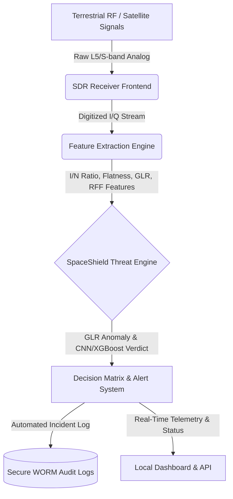

# SpaceShield STRIDE Threat Model

This document outlines the comprehensive security threat model for the SpaceShield architecture using the **STRIDE** methodology. It covers the end-to-end signal processing pipeline: from raw I/Q ingestion at the Software-Defined Radio (SDR), through feature extraction, Generalized Likelihood Ratio (GLR) testing, RF Fingerprinting (RFF) classification models, and up to the local API and operator dashboard.

---

## Architecture Overview

---

## STRIDE Threat Matrix

### 1. Spoofing (S)

*   **Target Asset / Vulnerability:** Receiver Tracking Loops (Phase-Locked Loop / Delay-Locked Loop) and RF Fingerprinting (RFF) Classifier Database.
*   **Threat Scenario:** 
    An adversary broadcasts counterfeit, phase-coherent RF signals mimicking legitimate NavIC GEO/GSO satellites using commercial, low-cost Software-Defined Radios (SDRs). The spoofer slowly increases its power level to hijack the receiver's tracking loops, executing a frequency and timing "drag-off" attack. This introduces false pseudorange rates, leading to inaccurate positioning or timing synchronization failures on the ground station.
*   **Mitigation Strategy:**
    *   **Generalized Likelihood Ratio (GLR) Path Anomaly Detection:** The SpaceShield Threat Engine monitors the moving variance of frequency drifts. Under normal conditions, NavIC satellites maintain ultra-stable paths due to atomic clocks. Spoofing attempts trigger a GLR path anomaly (gamma threshold $\gamma = 9.8$ for false alarm probability $P_{fa} = 10^{-7}$).
    *   **RF Fingerprinting (RFF) Hardware Footprint Classification:** The system leverages a dual-classifier framework: a **Complex CNN** (99.9% accuracy) and **XGBoost** (91.5% accuracy). This engine identifies physical hardware imperfections in the received signal—such as Carrier Frequency Offset (CFO), I/Q amplitude/phase imbalance, and phase noise—inherent to low-grade commercial SDR oscillators and mixers, rejecting unauthorized hardware footprints even if the signal content is coherent.

---

### 2. Tampering (T)

*   **Target Asset / Vulnerability:** Feature Extraction Engine (in-memory I/Q buffers) and Machine Learning Model Weights (`rf_threat_simulator.py` execution space).
*   **Threat Scenario:** 
    An attacker who has gained local access or compromised a neighboring service on the host system injects fabricated I/Q samples directly into the digital ingestion buffer or alters the stored model weights of the RFF classifier (e.g., tampering with XGBoost thresholds or CNN structures). This forces the engine to classify a malicious spoofing signal as `NORMAL`.
*   **Mitigation Strategy:**
    *   **Code and Model Integrity Verifications:** Implement load-time integrity checks using SHA-256 hash validation for all model parameter files and executable scripts.
    *   **Strict Memory Bound Controls:** Enforce boundaries and size checks on the incoming digitized signal streams. Raw arrays are validated against absolute RMS power limits (e.g., saturation ceilings) and physical characteristics (e.g., finite float validations) prior to feature extraction to prevent buffer injection attacks.

---

### 3. Repudiation (R)

*   **Target Asset / Vulnerability:** Compliance Incident Reports (`certin_incident_*.json`) and Rolling Security Logs (`spaceshield_180day_security.log`).
*   **Threat Scenario:** 
    An insider threat or a compromised administrative account deletes or alters local threat logs following a successful jamming or spoofing incident. By clearing the history, the attacker hides the intrusion, avoiding the mandatory 6-hour CERT-In incident reporting compliance and frustrating forensic audits.
*   **Mitigation Strategy:**
    *   **Write-Once-Read-Many (WORM) Logging:** SpaceShield implements a secure file lifecycle. Whenever a new incident is written, the file permissions are dynamically configured. The script unlocks the log, appends the entry, and immediately applies a read-only lock (`stat.S_IREAD` / `0444` permissions) to prevent modification.
    *   **Cryptographic Hash Chaining:** Every log entry contains a `prev_hash` field referencing the SHA-256 digest of the previous line, creating an append-only, tamper-evident cryptographic chain. Any modification of past logs breaks the validation chain.
    *   **CERT-In Space Cyber Security Compliance:** Triggers automated warnings specifically alerting operators when an incident requires reporting within the mandatory 6-hour window.

---

### 4. Information Disclosure (I)

*   **Target Asset / Vulnerability:** Local API endpoints, raw telemetry logs, and generated Dashboard Visuals (`outputs/spaceshield_dashboard_*.png`).
*   **Threat Scenario:** 
    An unauthorized user on the network intercepts local API payloads or accesses the `outputs/` folder. By reading the precise RF telemetry (such as carrier frequency offsets, phase noise patterns, and signal strength), the attacker obtains actionable intelligence regarding the ground station's local receiver tolerances and operating schedules.
*   **Mitigation Strategy:**
    *   **REST/gRPC API Transport Security:** All downstream API telemetry transmissions are protected using mutual TLS (mTLS) with strong cipher suites to prevent eavesdropping.
    *   **Access Control Lists (ACLs):** Enforce strict operating system-level ACLs (DACLs on Windows, `chmod 700` on Unix/Linux) to limit access to the `data/` and `outputs/` directories to the dedicated `spaceshield` service account.

---

### 5. Denial of Service (D)

*   **Target Asset / Vulnerability:** SDR Analog-to-Digital Converter (ADC) input buffers, Feature Extraction pipeline, and local host CPU/GPU resources.
*   **Threat Scenario:** 
    An adversary deploys a high-power broadband jammer targeting the NavIC L5 band (1176.45 MHz). The massive RF energy saturates the SDR frontend, flooding the digitization pipeline with massive values and causing CPU starvation during FFT/Welch spectral density computation, rendering the threat engine unable to process signals.
*   **Mitigation Strategy:**
    *   **ITU-R M.1902-2 Limit Enforcement:** The feature extraction engine continuously monitors the Interference-to-Noise (I/N) ratio. If it exceeds the regulatory limit of $-6$ dB, the channel is immediately flagged as a `VIOLATION`. The receiver frontend triggers automated AGC (Automatic Gain Control) attenuation or switches to auxiliary antennas.
    *   **Decoupled & Throttled Processing:** Signal ingestion utilizes fixed-size circular ring buffers to prevent memory consumption spikes. The heavy mathematical operations (FFT/Welch PSD calculations) are isolated from the main receiver thread, ensuring the core alerting engine remains operational even if the spectral density visualizer drops frames.

---

### 6. Elevation of Privilege (E)

*   **Target Asset / Vulnerability:** Edge Daemon Execution Privilege (`rf_threat_simulator.py` process space) and local system services.
*   **Threat Scenario:** 
    An attacker exploits a deserialization flaw or a buffer overflow vulnerability within the libraries used by the simulator (e.g., numpy, scipy) by feeding crafted, malformed digital I/Q streams. If the simulator process runs with administrative privileges, the attacker gains full control over the ground station operating system.
*   **Mitigation Strategy:**
    *   **Rootless Execution & Container Isolation:** SpaceShield is designed to run inside a sandboxed Docker/Podman container using a non-root user account (`USER spaceshield`). The container lacks administrative capabilities (`CAP_SYS_ADMIN` is disabled).
    *   **System Call Auditing:** Implement strict AppArmor/SELinux profiles restricting the simulator's access strictly to the USB/PCIe paths of the SDR hardware and the designated logging directories, preventing arbitrary shell spawning.
